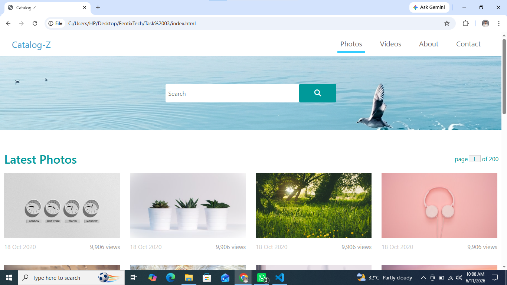
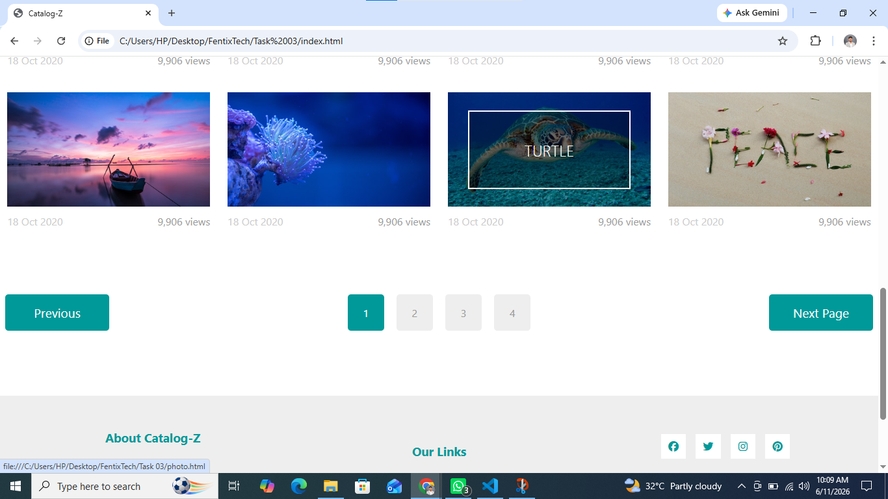

# Catalog-Z — Photo & Video Catalog Website

A fully hand-coded clone of the **TemplateMo 556 Catalog-Z** template, built from scratch using only **HTML, CSS, and vanilla JavaScript** — no frameworks, no libraries. The project is fully responsive and works across all screen sizes.

---

##  Live Preview

(https://abdulahh23-catalog-z.netlify.app/)

---

##  Screenshots





---

##  Features

-  **Photo & Video Catalog** — Flexbox layout showcasing photos and videos with category filtering
-  **6 HTML Pages** — Homepage, Photo Detail, Video Detail, About, Contact, and more
-  **Fully Responsive** — Adapts seamlessly to mobile, tablet, and desktop screens
-  **Pure HTML & CSS** — No CSS frameworks; all styling written by hand
-  **Vanilla JavaScript** — Lightweight interactions without jQuery or any JS library
- **Footer Section** — Clean footer with links and info columns

---

##  Built With

| Technology | Purpose |
|---|---|
| HTML5 | Page structure and semantics |
| CSS3 | Styling, layout, animations |
| JavaScript (ES6) | DOM interactions, filtering |
| Font Awesome | Icons |

---

##  Getting Started

No installation or build step needed. Just clone and open.

```bash
git clone https://github.com/your-username/catalog-z.git
cd catalog-z
```

Then open `index.html` in your browser — that's it.

---

##  Purpose

This project was built as a **front-end development practice project** to sharpen skills in:

- Writing clean, semantic HTML
- Crafting responsive layouts using pure CSS (Flexbox & Grid)
- Building multi-page static websites
- Recreating professional UI designs from scratch

---

##  License

This project is a hand-coded recreation inspired by the [TemplateMo 556 Catalog-Z](https://templatemo.com/tm-556-catalog-z) template, which is free for personal and commercial use. All code in this repository was written independently.

---

##  Author

**Abdullah Shahid**
-  BSIT Student — Information Security, University of the Punjab
-  Web Development Intern @ FentixTech
-  [LinkedIn](https://www.linkedin.com/in/abdullah-shahid-b61666409/)
